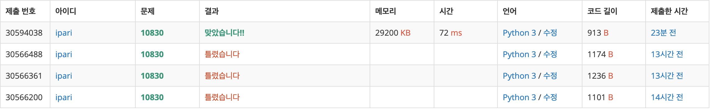

# 10830: 행렬 제곱

https://www.acmicpc.net/problem/10830

- 행렬의 곱은 결합법칙이 성립하므로 이를 활용한다.
- A^1로 A^2를 구하고, A^2로 A^4를 구하고... 를 반복한다.
- 따라서 B를 이진수로 만들고 위에서 계산해둔 행렬의 곱을 다시 곱하여 최종 결과를 구한다.

- 1~3은 코드의 버그로 인해 우연히 발생한 행렬곱의 패턴으로 해결하려다 실패
- 4에서 정상적인 방법으로 접근하여 해결
