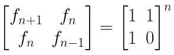
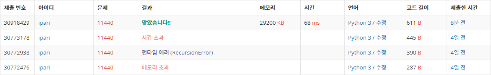

# 11440: 피보나치 수의 제곱의 합

https://www.acmicpc.net/problem/11440

- 제곱이라는 점에서 면적 개념으로 생각해보았다.
- 그림을 그리다보니 피보나치 수 제곱의 합이 f(n) * f(n + 1) 이라는 패턴을 찾았다.
- 그러면 이제 지난 [행렬 제곱](../11830)  동일한 문제가 된다.

- 일반적인 방법으로 푸니 메모리나 시간 초과가 발생하였다.
- 특수한 패턴을 찾아야 풀 수 있는 문제라 생각하고 패턴을 찾는 방향으로 선회했다.
