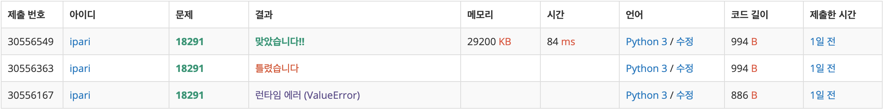

# 18291: 비요뜨의 징검다리 건너기

https://www.acmicpc.net/problem/18291

- 1부터 n까지 징검다리를 건너는 경우의 수는, 징검다리 2에서 n-1까지의 n-2개 징검다리 중 0에서 n-2개의 징검다리를 선택한 값을 더하는 문제가 된다.
- 처음에는 팩토리얼 계산에서 분모의 역원을 구하여 나누려고 했음.
  - 그런데 10^9+7이 소수라는 조건이 없으므로 역원을 구할 방법이 없었다.
- 다른 방법으로 풀어야할 것 같아서 더 고민해보았더니, 각 조합이 이항계수이고 그 합이 2^N-2 라는 것을 깨달았다.

- 징검다리개수-2 로 계산을 하는데, 징검다리개수가 2 미만일 때 예외처리를 하지 않아서 다시 함.
- 1에서 1로 가는 것을 X가 1 이상이므로 갈 곳이 없기에 0으로 처리했었는데, 1가지 경우로 치는구나 싶어서 1로 수정하니 통과했다.
